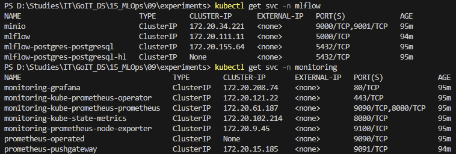
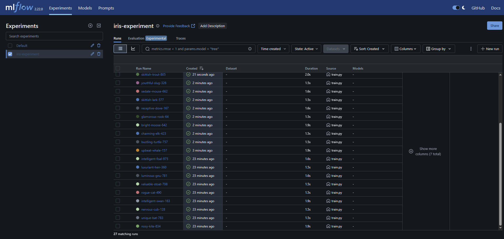
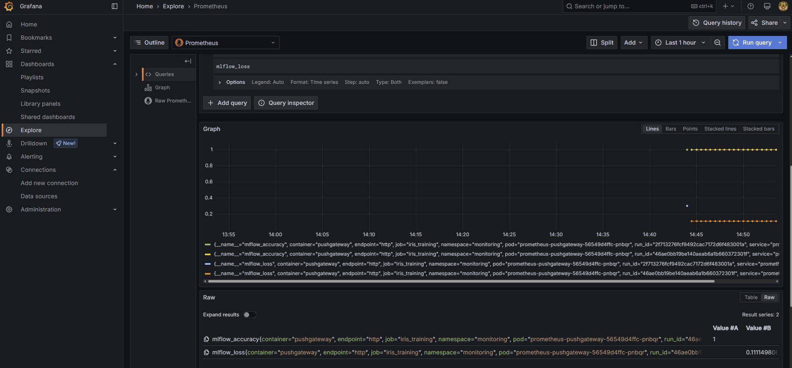

## 1. Deploy an EKS cluster and argocd (run in both folders):

```powershell
terraform init
terraform plan
terraform apply
```
Note: update kube-config if necessary:
```powershell
aws eks update-kubeconfig --region eu-north-1 --name argocd-eks-cluster
```
## 2. Open port to argocd and get password to log in:

```powershell
kubectl port-forward svc/argocd-server -n infra-tools 8080:80

kubectl -n infra-tools get secret argocd-initial-admin-secret -o jsonpath="{.data.password}" | ForEach-Object { [System.Text.Encoding]::UTF8.GetString([System.Convert]::FromBase64String($_)) }
```
## 3. Deploy argoapps into  cluster:

```powershell
kubectl apply -f root-app.yaml
```

After deploy, check that all pods are running



## 4. Forward the necesary ports (mlflow, pushgateway, prometheus, grafana):

```powershell
kubectl port-forward svc/mlflow -n mlflow 5000:5000
kubectl port-forward svc/monitoring-kube-prometheus-prometheus -n monitoring 9090:9090
kubectl port-forward svc/prometheus-pushgateway -n monitoring 9091:9091 
kubectl port-forward svc/monitoring-grafana -n monitoring 3000:80

```

## 5. Install requirements and run script:

```powershell
pip install -r experiments/requirements.txt
python3 experiments/train_and_push.py
```

## 6. Check data passed to mlflow and grafana through pushgateway -> prometheus:

### localhost:5000
Experiments -> iris-experiment



### localhost:3000
Eplore -> search loss and acuracy



## 7. Check that the best-performing model is stored locally (best_model):


### 8. Destroy all resources:

```powershell
terraform destroy

```
